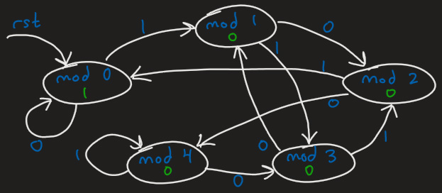

# Streaming divisibility checker RTL generator and UVM testbench

* [Overview](#Overview)
* [State transition diagrams](#State-transition-diagrams)
* [Structure](#Structure)
* [Running](#Running)
* [Other commands](#Other-commands)

## Overview

* Takes a bitstream as input, and outputs whether the bitstream thus far is divisible by a fixed integer divisor N
* Inspired by a state diagram interview question I once received long ago.  I later decided to:
    * Implement the concept into a functional Verilog module
    * Generalise it by writing a script that generates the Verilog module for any user-specified divisor, programmatically computing all state transitions
    * Construct a UVM testbench around it
    * Write tests that verify the DUT and collect coverage
    * Wrap it all in a [Makefile](Makefile)

## State transition diagrams

Divisor of 3:<br/>


Divisor of 5:<br/>


## Structure

* [`design/`](design/) ("IP"):
    * [`rtl/`](design/rtl/):
        * [`top.v`](design/rtl/top.v): Top RTL module that instantiates below two modules
        * `divisible_by_N.v`: Takes a bitstream as input, and outputs whether the bitstream thus far is divisible by a fixed integer divisor N (generated from scratch by [`gen_divisible_by_N_fsm.py`](design/gen_divisible_by_N_fsm.py) script)
        * [`div_counter.v`](design/rtl/div_counter.v): Counts the number of times that a positive and valid 'divisible' result was encountered; counter is exposed as a register
    * [`gen_divisible_by_N_fsm.py`](design/gen_divisible_by_N_fsm.py): Script that generates `divisible_by_N.v` for an arbitrary user-specified divisor
* [`verif/`](verif/) ("VIP"):
    * Complete UVM testbench for streaming divisibility checker
    * Testbench is static, aside from a one-line `div_by_define.svh` file (generated by `make vip`) containing a `define of the fixed integer divisor that the DUT was generated for
    * Testbench source file include list is in [`div_uvm_tb.svh`](verif/div_uvm_tb.svh)
    * Tests reside in [`test_collection.sv`](verif/test_collection.sv)

## Running

Synopsys VCS:
* `git clone git@github.com:willch3n/code_samples.git`
* `cd divisible_by_n_ip_vip`
* `make all DIV_BY=5`

Other simulators, such as Aldec Riviera Pro on EDA Playground:
* `git clone git@github.com:willch3n/code_samples.git`
* `cd divisible_by_n_ip_vip`
* `make ip DIV_BY=5`
* `make vip DIV_BY=5`
* Compile and run according to your simulator's instructions, with option `+UVM_TESTNAME=test_base`

## Other commands

Copied from output of `make help`:
```
# Target: all     - [Default] Makes and compiles "IP" and "VIP", runs sim, generates coverage report
# Target: ip      - Generates a divisibility checker FSM for fixed integer divisor N in Verilog
# Target: vip     - Writes a 'DIV_BY' `define to inform testbench of divisor that DUT was generated for
# Target: compile - Compiles design and testbench
# Target: sim     - Runs a simulation using VCS
# Target: cov     - Generates a coverage report in HTML format
# Target: clean   - Removes all generated files for starting over
# Target: help    - Lists each available make target and its purpose
# Target: debug   - Prints all macros and their values, for debugging purposes
```

