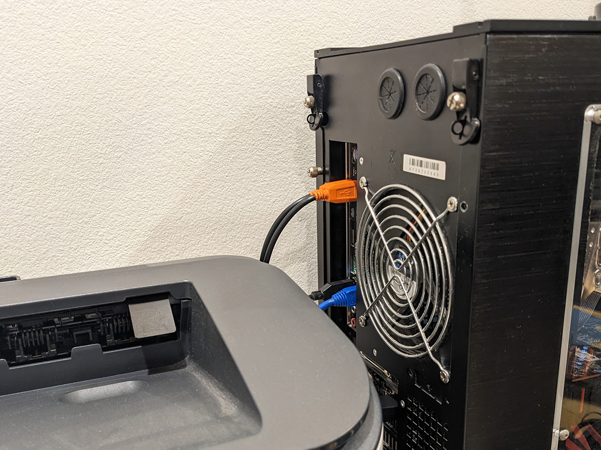
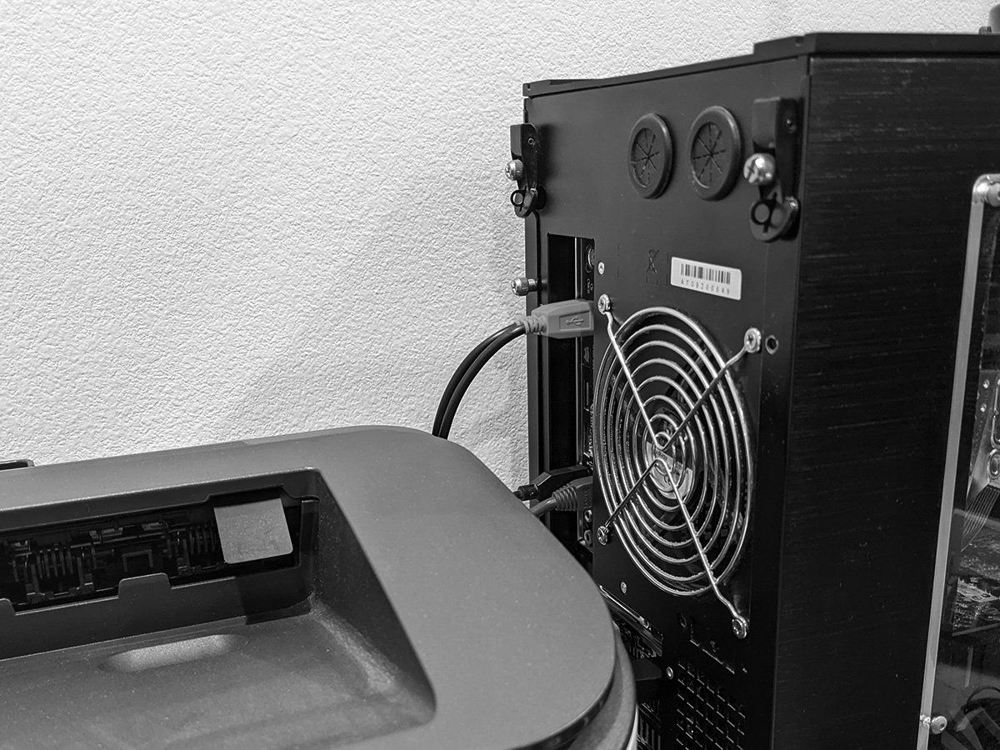
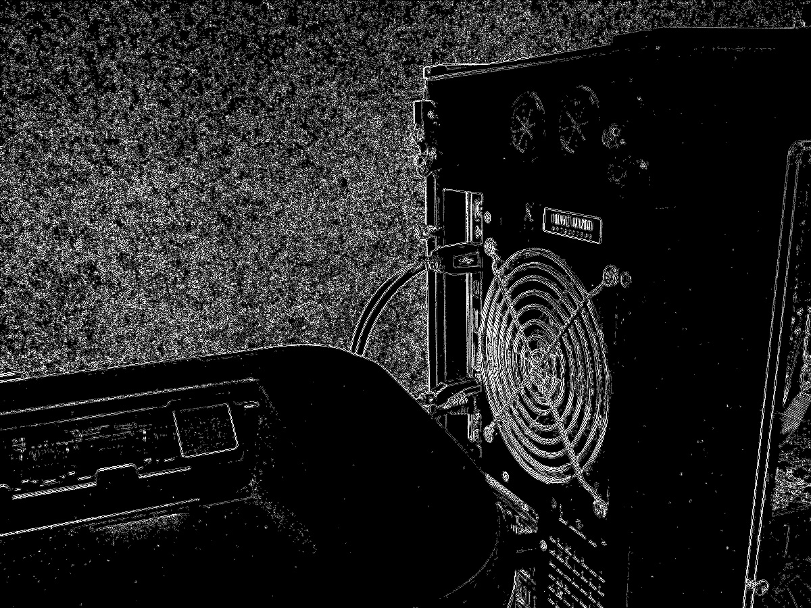

# Computer vision edge detector in Python

* [Overview](#Overview)
* [Method](#Method)
* [Arguments](#Arguments)
* [Example](#Example)
* [Limitations](#Limitations)
* [References](#References)

## Overview

* Applies an edge detection operator to an input greyscale image, producing a new greyscale image file with detected edges marked
* Employs algorithms commonly used in computer vision systems

## Method

* Compute intensity gradient of image by convolving 3x3 Laplacian second derivative approximation kernel across each pixel of input image
* Apply edge thinning using non-maximum suppression, to remove pixels not considered to be part of an edge
* Apply edge tracking using double-threshold hysteresis, to filter out spurious edges caused by noise and color variation

## Arguments

Copied from output of `edge_detect.py --help`:
```
usage: edge_detect.py [-h] [-v] in_img_name out_img_name

Applies an edge detection operator to an input greyscale image, producing a new
greyscale image file with detected edges marked

positional arguments:
  in_img_name    Path to input image to perform edge detection on
  out_img_name   Desired name of output image file with detected edges marked

optional arguments:
  -h, --help     show this help message and exit
  -v, --verbose  Enables verbose logging to facilitate debugging
```

## Example

```
git clone git@github.com:willch3n/code_samples.git
cd img_edge_detector
./edge_detect.py images/pc_rear.pgm images/pc_rear_edges.pgm
```

Original color image taken using phone camera:<br/>


Converted to 8-bit PGM format:<br/>


Output image with detected edges marked:<br/>


## Limitations
* Algorithm implementations are not the most optimal, concise, or efficient, because it is written with the intent to be used as a reference model and debugging aid for a Verilog module
* Accepts input image in only 8-bit PGM (portable grey map) format
* Produces output image in only 8-bit PGM (portable grey map) format
* Currently omits commonly-employed Gaussian smoothing step

## References
* [OpenCV documentation - Canny Edge Detector](https://docs.opencv.org/2.4/doc/tutorials/imgproc/imgtrans/canny_detector/canny_detector.html)
* [Stepping Into the Filter - Understanding the Edge Detection Algorithms in Your Smartphone](https://cse442-17f.github.io/Sobel-Laplacian-and-Canny-Edge-Detection-Algorithms/)
* [PGM Format Specification](https://netpbm.sourceforge.net/doc/pgm.html)

